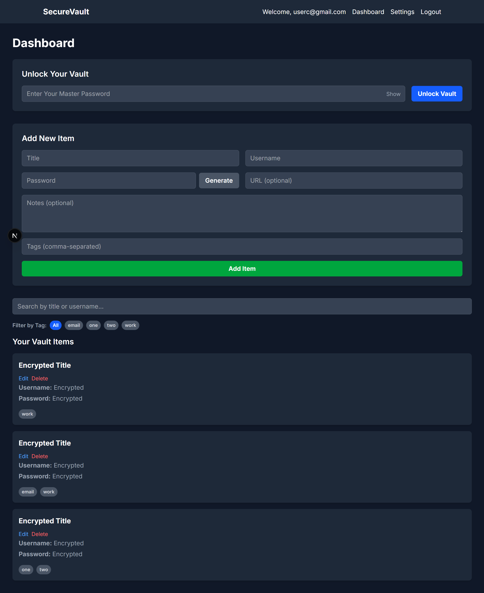

# SecureVault - A Zero-Knowledge Password Manager

A fully-featured, privacy-first password manager built with Next.js and MongoDB. All data is encrypted and decrypted on the client-side, meaning the server never has access to your plaintext secrets.

**Live Demo:** [https://secure-vault-livid.vercel.app/login](https://secure-vault-livid.vercel.app/login)





## Features

- [x] **Zero-Knowledge Architecture:** All encryption/decryption happens in the browser.
- [x] **Strong User Authentication:** Secure registration and login with JWT sessions.
- [x] **Full CRUD Functionality:** Create, view, edit, and delete secure vault items.
- [x] **Password Generator:** Create strong, unique passwords with customizable options.
- [x] **Secure Copy:** Copy credentials to the clipboard with an automatic 15-second clear.
- [x] **Real-time Search & Filtering:** Instantly search by text and filter by tags.
- [x] **Tags System:** Organize your vault items with flexible, multi-word tags.
- [x] **2FA Setup:** Users can enable Time-based One-Time Password (TOTP) for their accounts.
- [x] **Encrypted Export/Import:** Securely back up your entire vault to a local file and migrate data between accounts.
- [x] **Protected Routes:** Sensitive pages are protected from unauthenticated access.
- [x] **Professional UI:** A clean, responsive, dark-themed UI with toast notifications for user feedback.

## Tech Stack

* **Framework:** Next.js (App Router)
* **Language:** TypeScript
* **Database:** MongoDB (via Mongoose)
* **Styling:** Tailwind CSS
* **Authentication:** JWT (JSON Web Tokens), `bcryptjs`
* **Encryption:** `crypto-js`
* **2FA:** `speakeasy`, `qrcode`
* **Validation:** `zod`
* **UI Feedback:** `react-hot-toast`

## Running Locally

To run this project on your local machine, follow these steps:

1.  **Clone the Repository**
    ```bash
    git clone [your-repo-url]
    cd secure-vault
    ```

2.  **Install Dependencies**
    ```bash
    npm install
    ```

3.  **Set Up Environment Variables**
    Create a file named `.env.local` in the root of the project and add the following variables:
    ```
    MONGODB_URI="your_mongodb_connection_string"
    JWT_SECRET="your_super_secret_jwt_key"
    ```

4.  **Run the Development Server**
    ```bash
    npm run dev
    ```
    The application will be available at `http://localhost:3000`.

## A Note on the Cryptography

This application implements a zero-knowledge architecture using client-side encryption. All sensitive data is encrypted with the **AES-256** standard. The encryption key is derived from the user's master password using **PBKDF2** with a unique, cryptographically-secure salt for each item to protect against pre-computation and rainbow table attacks.
